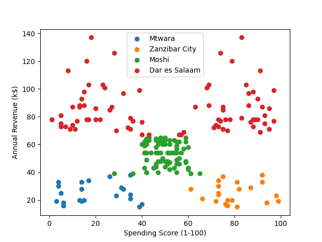
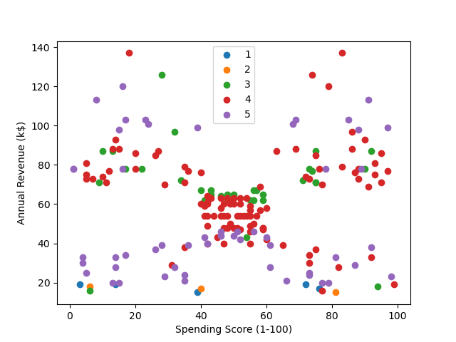
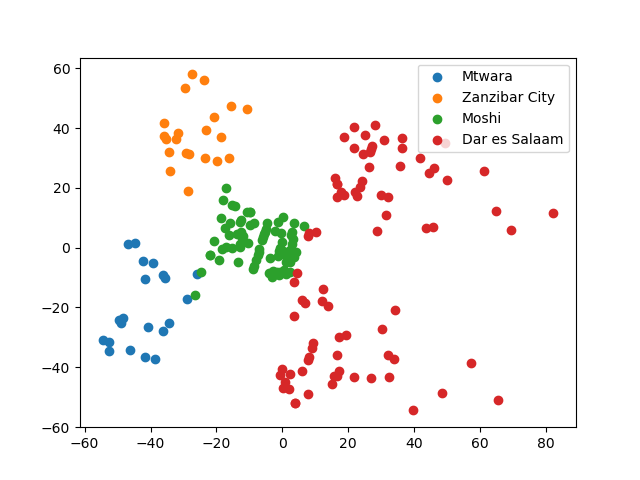
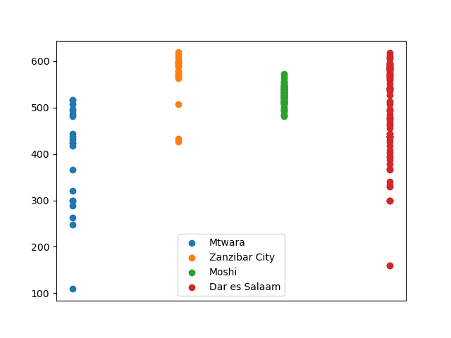

# Ramani Take Home Interview
## First Look
First takeaways from the dataset are fairly straightforward: Zanzibar City has the consistently highest spending score, but along with Mtwara, has a mixed bag of repayment scores. Moshi and Dar es Salaam offer chances for higher margins given the merchants' higher income and consistent repayment, but they come with more risk in the spending score. With a low spending score, low revenue, and fairly widely distributed repayment score, Mtwara should be avoided, as reinvestment there offers no true benefit over the other cities.




## PCA Analysis
An initial PCA analysis of the continuous data by city confirms earlier conclusions. Moshi, Mtwara, and Zanzibar City all follow similar patterns when it comes to Revenue, Spending Score, and Repayment Score correlations, with Moshi being the most "average". However, Dar es Salaam is fairly distributed across the PCA map and would present more risk in, well, predicting risk.
This PCA map is also identical to one broken down by Most Purchased Product, as the product most bought is the same per city. 



## Credit Scoring
A credit algorithm was written based on the scores given to merchants by Ramani, and then categorized by city. 

$C = log(SS * RS) * 100$

Dodoma can then scale its investments in merchants based on their credit score, or have a total cutoff at a score or percentile. This method of credit scoring also displays the low variance of merchants in Moshi, the risk of Dar es Salaam, and especially the risk of Mtwara.



## Conclusions
There are two main problems: understanding where money is being wasted (redistribution of resources and product for more efficiency and less overhead) and understanding where money needs to be invested (risk versus return). Currently, based on clustered learning and credit analysis, I would recommend that Dodoma move resources out of Mtwara. A combination of low spending scores, low revenue, and low repayment scores do not inspire confidence. If a presence in the city is needed, stick with a top percentile of creditors, but otherwise, Dodoma will get far more consistent results from investing into Zanzibar City or Moshi merchants. As for increasing profits, that depends on Dodoma's risk threshold and tolerance. Dar es Salaam offers the highest options for growth and revenue, but is riskier than Zanzibar City or Moshi. Similarly, though Zanzibar City has the highest average spending score, it involves more risk in repayment than Moshi with lower revenue. You can again stratify by merchant credit score, as it is log proportional to the scores given by Ramani. 

# Installation and Usage
With conda installed on your OS of choice, run the following from the root folder:
```
conda env create -n ddma --file dodoma.yml
conda activate ddma
```
From here, you can run any of the scripts for visualization of the graphs, pca analysis, or credit scoring.
```
python scripts/revenue_vis.py
python scripts/pca_analysis.py
python scripts/credit_score.py
```